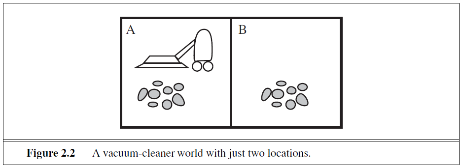

# Trabajo Práctico 2: Agentes Racionales 

**Estudiante:** Del Longo, Micaela

[**Link al TP:** https://docs.google.com/document/d/1IfD2rfzS-OBa9bLG6XfHMr4gJYbrktLxAahTQBz-i0E/edit#heading=h.k95nk1o7cede](https://docs.google.com/document/d/1IfD2rfzS-OBa9bLG6XfHMr4gJYbrktLxAahTQBz-i0E/edit#heading=h.k95nk1o7cede)

## Ejercicio F)
Responder preguntas 2.10 y 2.11 de AIMA 3ra Edición.

### Simple vacuum-cleaner agent

  

Consider the simple vacuum-cleaner agent that cleans a square if it is dirty and moves to the other square if not. Is this a rational agent?
That depends! First, we need to say what the performance measure is, what is known about the environment, and what sensors and actuators the agent has. Let us assume the following:
- The **performance measure** awards one point for each clean square at each time step over a “lifetime” of 1000 time steps.
- The **“geography”** of the environment is known a priori (Figure 2.2) but the dirt distribution and the initial location of the agent are not. Clean squares stay clean and sucking cleans the current square. The Left and Right actions move the agent left and right except when this would take the agent outside the environment, in which case the agent remains where it is.
- The only available **actions** are Left, Right, and Suck.
- The agent correctly perceives its location and whether that location contains dirt.

We claim that under these circumstances the agent is indeed rational; its expected performance is at least as high as any other agent’s. 

One can see easily that the same agent would be irrational under different circumstances. For example, once all the dirt is cleaned up, the agent will oscillate needlessly back and forth; if the performance measure includes a penalty of one point for each movement left or right, the agent will fare poorly. A better agent for this case would do nothing once it is sure that all the squares are clean. If clean squares can become dirty again, the agent should occasionally check and re-clean them if needed. If the geography of the environment is unknown, the agent will need to explore it rather than stick to squares A and B.

The simplest kind of agent is the **simple reflex agent**. These agents select actions on the basis of the current percept, ignoring the rest of the percept history. For example, the vacuum agent is a simple reflex agent, because its decision
is based only on the current location and on whether that location contains dirt.

### Ejercicio 2.10
Consider a modified version of the vacuum environment in Exercise 2.8, in which the agent is penalized one point for each movement.

**a.** Can a simple reflex agent be perfectly rational for this environment? Explain.

No, ya que la toma de decisiones del agente se basa únicamente en el percept actual. No tiene en cuenta las posibles consecuencias futuras de sus acciones, como la acumulación de penalizaciones por movimientos innecesarios. Por lo tanto, no puede tomar decisiones óptimas que consideren el rendimiento a largo plazo.

**b.** What about a reflex agent with state? Design such an agent.

Un agente reflexivo con estado podría tener un mejor rendimiento. Recordaría las acciones y percepts anteriores, lo que le permitiría tomar decisiones basadas en un contexto más amplio en lugar de solo el percept actual. Por ejemplo, el agente podría recordar el estado anterior (limpio o sucio) de cada cuadrado y su propia ubicación, y usar esta información para decidir si moverse o aspirar. 

**c.** How do your answers to a and b change if the agent’s percepts give it the clean/dirty status of every square in the environment?

El proceso de toma de decisiones sería mucho más simple. Un *agente reflexivo simple* podría ser perfectamente racional. Tendría información completa sobre el estado actual del entorno y podría elegir fácilmente acciones para maximizar su rendimiento sin realizar movimientos innecesarios. Un *agente reflexivo con estado* también podría funcionar de manera óptima en este escenario, ya que aún podría usar el contexto adicional para tomar decisiones más informadas.

### Ejercicio 2.11
Consider a modified version of the vacuum environment in Exercise 2.8, in which the *geography of the environment*—its extent, boundaries, and obstacles—is **unknown**, as is the *initial dirt configuration*. (The agent can go Up and Down as well as Left and Right .)

**a.** Can a simple reflex agent be perfectly rational for this environment? Explain.

No, un agente reflexivo simple va a funcionar solo va a funcionar si la decisión correcta puede realizarse basándose solamente en el percept actual. Dado que el agente carece de información sobre la disposición del entorno y la distribución de suciedad, no puede tomar decisiones óptimas basándose únicamente en el percept actual. Necesita una comprensión más amplia del entorno para navegar de manera efectiva.

El agente aspiradora tiene solos dos percepts posibles [Dirty] y [Clean]. Puede aspirar (Suck) en respuesta a [Dirty] y puede moverse (Up, Down, Left y Right) en respuesta a [Clean]. Sin embargo, si se mueve hacia arriba (Up) en el extremo superior del ambiente este fracasa infinitamente. De forma similar sucede en los otros extremos.

**b.** Can a simple reflex agent with a randomized agent function outperform a simple reflex agent? Design such an agent and measure its performance on several environments.

Sí, en un ambiente pequeño. A través de la aleatoriedad puede escaparse de bucles infinitos. Por ejemplo, si el agente percibe [Clean] este puede elegir de manera aleatoria al siguiente movimiento. 

La aleatoriedad en sus acciones podría ayudar al agente a explorar diferentes partes del entorno, aumentando las posibilidades de encontrar suciedad y tomar decisiones efectivas. 

**c.** Can you design an environment in which your randomized agent will perform poorly? Show your results.

Sí, un ambiente con estructura tipo laberinto o con puntos aislados de suciedad (Dirt) pueden hacer que el agente aleatorio actúe pobremente. Las acciones aleatorias podrían liderar al agente hacia caminos sin salida o alejarlo de áreas con suciedad.

**d.** Can a reflex agent with state outperform a simple reflex agent? Design such an agent and measure its performance on several environments. Can you design a rational agent of this type?

Sí, al mantener un historial de acciones y percepts anteriores, el agente puede formar un mapa parcial del entorno y ajustar su comportamiento en función de los patrones aprendidos. Esto permitiría una toma de decisiones más informada y una exploración eficiente.

Diseñar un agente completamente racional de este tipo podría involucrar técnicas avanzadas como *reinforcement learning*. El agente aprendería de sus acciones y sus resultados para desarrollar una estrategia que maximice su rendimiento a largo plazo. Sin embargo, el rendimiento de dicho agente dependería en gran medida de la complejidad del entorno y los algoritmos de aprendizaje utilizados.