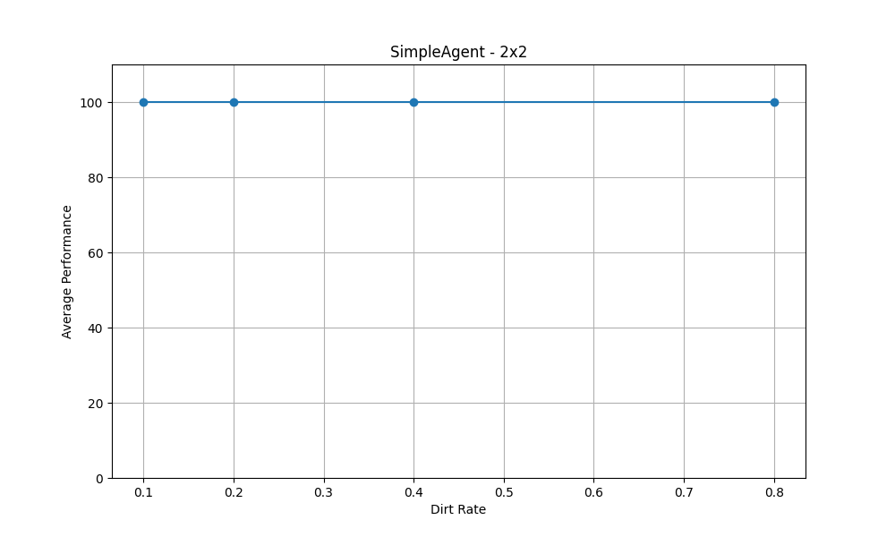
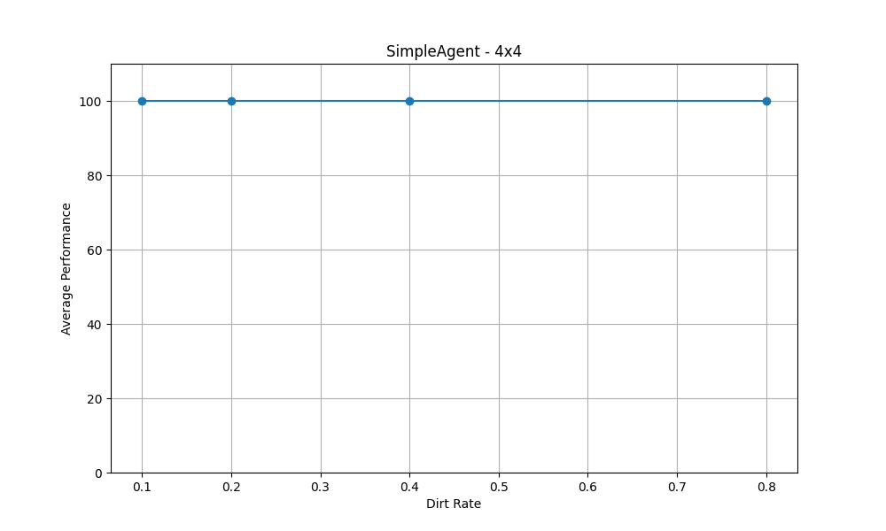
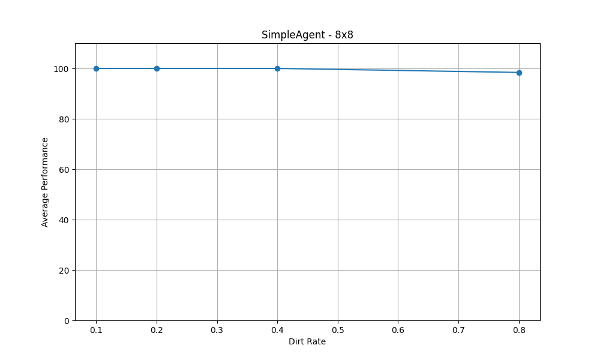
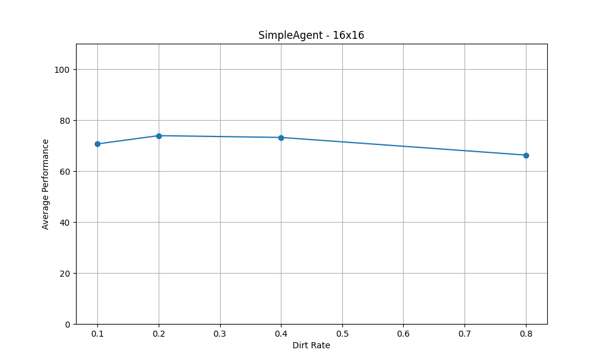
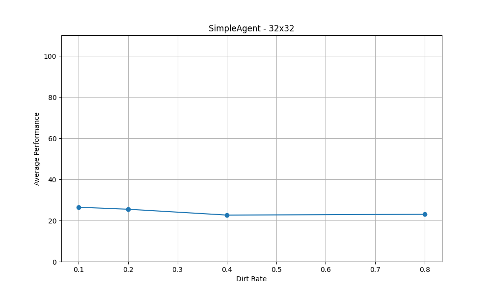
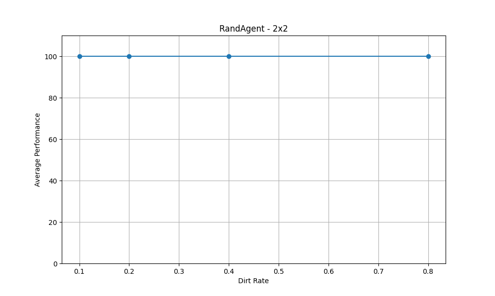
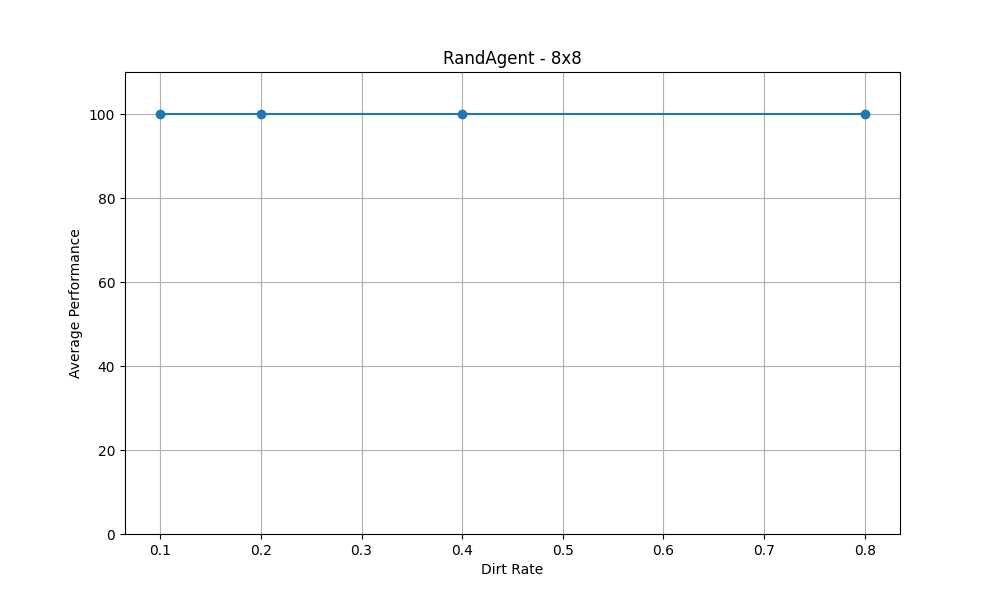
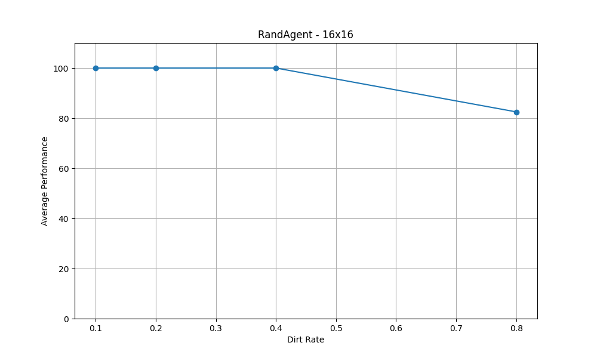
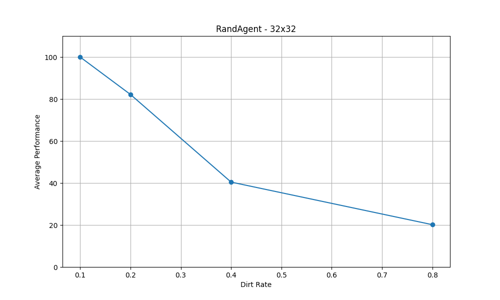

# Trabajo Práctico 2: Agentes Racionales 

**Estudiante:** Del Longo, Micaela

[**Link al TP:** https://docs.google.com/document/d/1IfD2rfzS-OBa9bLG6XfHMr4gJYbrktLxAahTQBz-i0E/edit#heading=h.k95nk1o7cede](https://docs.google.com/document/d/1IfD2rfzS-OBa9bLG6XfHMr4gJYbrktLxAahTQBz-i0E/edit#heading=h.k95nk1o7cede)

## Ejercicio D)
Evaluar el desempeño del agente agente reflexivo (medida de desempeño y unidades de tiempo consumidas) para:
1. Entornos de : 2x2, 4x4, 8x8, 16x16, 32x32, 64x64, 128x128 
2. Porcentaje de Suciedad en el ambiente: 0.1, 0,2 0,4, 0.8
3. Repetir 10 veces cada combinación.

### Resultados

**Average Performance** se calcula como: (total limpiado/suciedad inicial) * 100.

## Ejercicio E)
Repetir el procedimiento descrito en el punto C, para el caso de un agente con comportamiento totalmente aleatorio. En cada periodo de tiempo, el agente toma una acción al azar.

### Resultados

**Average Performance** se calcula como: (total limpiado/suciedad inicial) * 100.

## Comparación

| dirt_rate |              |     0.1      |     0.2      |     0.4      |     0.8      |
|:---------:|:------------:|:------------:|:------------:|:------------:|:------------:|
| agent_name | environment_size | | | |
| RandAgent  |        2x2      | 100.000000   | 100.000000   | 100.000000   | 100.000000   |
|            |        4x4      | 100.000000   | 100.000000   | 100.000000   | 100.000000   |
|            |        8x8      | 100.000000   | 100.000000   | 100.000000   | 100.000000   |
|            |      16x16      | 100.000000   | 100.000000   | 100.000000   |  82.497247   |
|            |      32x32      | 100.000000   |  82.169074   |  40.435859   |  20.155529   |
|            |      64x64      |  41.281892   |  21.084035   |  10.126054   |   5.003983   |
|            |     128x128     |  10.087896   |  5.062855    |  2.618181    |  1.218101    |
| SimpleAgent|        2x2      | 100.000000   | 100.000000   | 100.000000   | 100.000000   |
|            |        4x4      | 100.000000   | 100.000000   | 100.000000   | 100.000000   |
|            |        8x8      | 100.000000   | 100.000000   | 100.000000   |  98.398912   |
|            |      16x16      |  70.669156   |  73.908132   |  73.205001   |  66.280554   |
|            |      32x32      |  26.456850   |  25.471153   |  22.642354   |  23.010112   |
|            |      64x64      |   7.526956   |   6.791559   |   7.282882   |   6.620408   |
|            |     128x128     |   2.127350   |  1.965913    |  2.014288    |   1.392578   |

### Resultados Viejos

| dirt_rate |              |     0.1      |     0.2      |     0.4      |     0.8      |
|:---------:|:------------:|:------------:|:------------:|:------------:|:------------:|
| agent_name | environment_size | | | |
| RandAgent  |        2x2      | 100.000000   | 100.000000   | 100.000000   | 100.000000   |
|            |        4x4      | 100.000000   | 100.000000   | 100.000000   | 100.000000   |
|            |        8x8      | 100.000000   | 100.000000   | 100.000000   | 100.000000   |
|            |      16x16      | 100.000000   | 100.000000   | 100.000000   |  83.634117   |
|            |      32x32      | 100.000000   |  82.740499   |  39.128693   |  20.534541   |
|            |      64x64      |  38.014212   |  20.814683   |  10.463958   |   4.925044   |
|            |     128x128     |  10.093033   |  5.269106    |  2.514469    |  1.294535    |
| SimpleAgent|        2x2      | 100.000000   | 100.000000   | 100.000000   | 100.000000   |
|            |        4x4      | 100.000000   | 100.000000   | 100.000000   | 100.000000   |
|            |        8x8      | 100.000000   | 98.516484    | 100.000000   |  99.378390   |
|            |      16x16      |  67.406246   | 66.912031    | 65.346272    |  67.823723   |
|            |      32x32      |  25.116305   | 28.038094    | 23.834187    |  22.670579   |
|            |      64x64      |   8.348226   |  6.650241    |  7.193141    |   5.956725   |
|            |     128x128     |   2.391104   |  1.997817    |  1.894557    |   1.573211   |