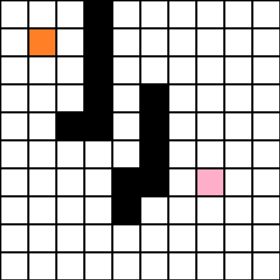

# Trabajo Práctico 3: Búsqueda no informada

**Estudiante:** Del Longo, Micaela

[**Link al TP:** https://docs.google.com/document/d/1xZF3YCyxGod-ceHELV0tk8tRhhCF83QYBzBGrV2ecKQ/edit](https://docs.google.com/document/d/1xZF3YCyxGod-ceHELV0tk8tRhhCF83QYBzBGrV2ecKQ/edit)

A partir de la lectura del CAP 3 de AIMA (3era edición) (en particular las secciones 3.1, 3.2, 3.3, 3.4.1, 3.4.2, 3.4.3 y 3.4.4). Completar los siguientes enunciados:

## Ejercicio A

Implementar un agente basado en objetivos que dado un punto de inicio y un punto destino, encuentre el camino óptimo.

Considerar lo siguiente:

1. El entorno del agente está compuesto por  una grilla de 100x100 en donde los obstáculos se generan al azar. Se trata de un entorno completamente observable, determinista y estático.

2. Las acciones posibles del agente son: (arriba, abajo, izquierda, derecha)
3. El agente deberá ser capaz de resolver el problema planteado mediante los siguientes algoritmos de búsqueda no informada:
   - Búsqueda por Anchura
   - Búsqueda por Profundidad 
   - Búsqueda Por Profundidad limitada
   - Búsqueda Uniforme
4. Al finalizar el proceso de formulación se deberán imprimir por pantalla:
   - La matriz generada con los obstáculos (opcional)
   - La secuencia de estados completa para llegar desde el estado inicial al estado destino. (si es posible)

## Ejercicio B

Ejecutar un total de 30 veces cada algoritmo en un escenario aleatorio con una tasa de obstáculos del 8 por ciento, calcular la media y la desviación estándar de la cantidad de estados explorados para llegar al destino (si es que fue posible). Evaluar cada uno de los algoritmos sobre el mismo conjunto de datos generado.  Presentar los resultados en un gráfico de cajas y bigotes o boxplots.

**Agente: BFSAgent**
- **Estados explorados en promedio:** 3783.733333333333
  - **Desviación estándar:** 2906.5214537174056
- **Costo de la solución en promedio:** 62.666666666666664
  - **Desviación estándar:** 41.3924308700677

**Agente: DFSAgent**
- **Estados explorados en promedio:** 3092.8333333333335
  - **Desviación estándar:** 2605.6938990223503
- **Costo de la solución en promedio:** 743.7333333333333
  - **Desviación estándar:** 521.570634177943

**Agente: DLSAgent**
- **Estados explorados en promedio:** 2409.4
  - **Desviación estándar:** 1504.9904708141441
- **Costo de la solución en promedio:** 185.6315789473684
  - **Desviación estándar:** 73.83631335319122

**Agente: UniformCostAgent**
- **Estados explorados en promedio:** 3854.0333333333333
  - **Desviación estándar:** 2893.5199120809925
- **Costo de la solución en promedio:** 62.666666666666664
  - **Desviación estándar:** 41.3924308700677

### Gráfico de cajas y bigotes o boxplots para los estados explorados

### Gráfico de cajas y bigotes o boxplots para el costo de la solución (path cost)

## Ejercicio C

¿Cuál de los 3 algoritmos considera más adecuado para resolver el problema planteado en A)?. Justificar la respuesta.

Teniendo en cuenta mi implementación y los resultados anteriores, el algoritmo que considero más adecuado es el de **búsqueda por anchura**. Esto se debe a que, en este caso, el *costo de las acciones es el mismo para todas*. BFS es completo, lo que garantiza encontrar una solución si existe, y encuentra la solución óptima en términos de longitud del camino, ya que explora todos los nodos en el mismo nivel antes de avanzar a niveles más profundos.

## Entornos Generados

### Entorno 1
 
### Entorno 2
 
### Entorno 3
 
### Entorno 4
 
### Entorno 5
 
### Entorno 6
 
### Entorno 6
 
### Entorno 8
 
### Entorno 9
 
### Entorno 10
 
### Entorno 11 
 
### Entorno 12 
 
### Entorno 13 
 
### Entorno 14 
 
### Entorno 15
 
### Entorno 16
 
### Entorno 17 
 
### Entorno 18 
 
### Entorno 19
 
### Entorno 20
 
### Entorno 21 
 
### Entorno 22
 
### Entorno 23
 
### Entorno 24
 
### Entorno 25
 
### Entorno 26
 
### Entorno 27
 
### Entorno 28
 
### Entorno 29
 
### Entorno 30
