# Trabajo Práctico 3: Búsqueda no informada

**Estudiante:** Del Longo, Micaela

[**Link al TP:** https://docs.google.com/document/d/1xZF3YCyxGod-ceHELV0tk8tRhhCF83QYBzBGrV2ecKQ/edit](https://docs.google.com/document/d/1xZF3YCyxGod-ceHELV0tk8tRhhCF83QYBzBGrV2ecKQ/edit)

## Ejercicio B

Ejecutar un total de 30 veces cada algoritmo en un escenario aleatorio con una tasa de obstáculos del 8 por ciento, calcular la media y la desviación estándar de la cantidad de estados explorados para llegar al destino (si es que fue posible). Evaluar cada uno de los algoritmos sobre el mismo conjunto de datos generado.  Presentar los resultados en un gráfico de cajas y bigotes o boxplots.
### Representación Tabular de los Resultados
También me pareció importante realizar los mismos cálculos para el costo de la solución encontrada por cada agente. 

| Agente           | Estados Explorados en Promedio | Desviación Estándar | Costo de la Solución en Promedio | Desviación Estándar |
|------------------|--------------------------------|---------------------|----------------------------------|---------------------|
| BFSAgent         | 3783.73                        | 2906.52             | 62.67                            | 41.39               |
| DFSAgent         | 3092.83                        | 2605.69             | 743.73                           | 521.57              |
| DLSAgent         | 2409.4                         | 1504.99             | 185.63                           | 73.84               |
| UniformCostAgent | 3854.03                        | 2893.52             | 62.67                            | 41.39               |

Los resultados sin redondear se encuentran en la sección [Raw Data](#raw-data) y los 30 entornos generados se encuentran en la sección [Entornos Generados](#entornos-generados).

### Gráfico de Cajas y Bigotes para los Estados Explorados
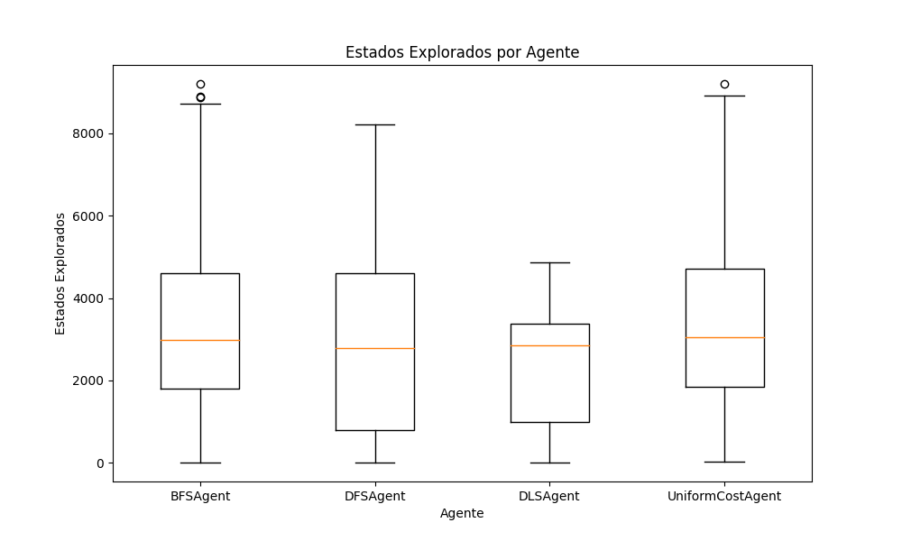

### Gráfico de Cajas y Bigotes para el Costo de la Solución (path_cost)

### Porcentaje de Entornos Resueltos
- Porcentaje de veces que **BFSAgent** encontró la solución: 100.00%
- Porcentaje de veces que **DLSAgent** encontró la solución: 60.00%
- Porcentaje de veces que **UniformCostAgent** encontró la solución: 100.00%
- Porcentaje de veces que **DFSAgent** encontró la solución: 100.00%

## Ejercicio C

¿Cuál de los 3 algoritmos considera más adecuado para resolver el problema planteado en A)?. Justificar la respuesta.

Teniendo en cuenta mi implementación y los resultados anteriores, el algoritmo que considero más adecuado es el de **búsqueda por anchura**. Esto se debe a que, en este caso, el *costo de las acciones es el mismo para todas*. BFS es completo, lo que garantiza encontrar una solución si existe, y encuentra la solución óptima en términos de longitud del camino, ya que explora todos los nodos en el mismo nivel antes de avanzar a niveles más profundos.

## Entornos Generados

### Entorno 1

  

### Entorno 2

  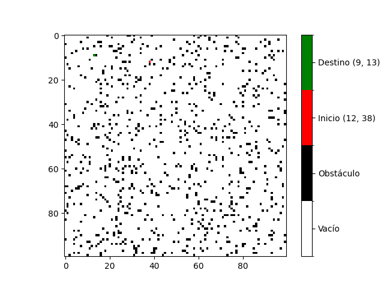

### Entorno 3

  

### Entorno 4

  

### Entorno 5

  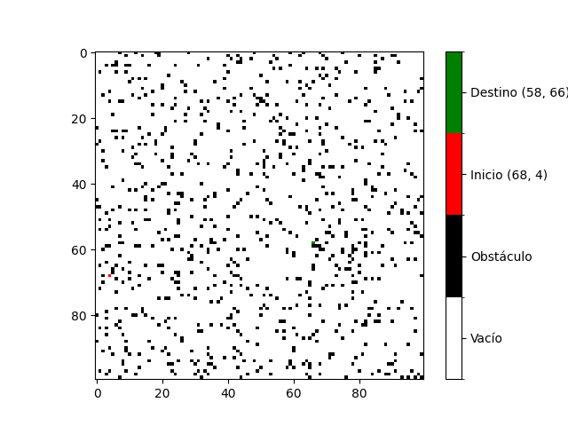

### Entorno 6

  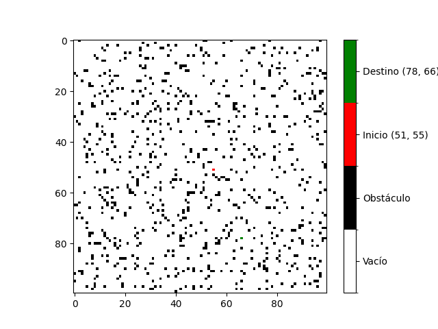

### Entorno 7

  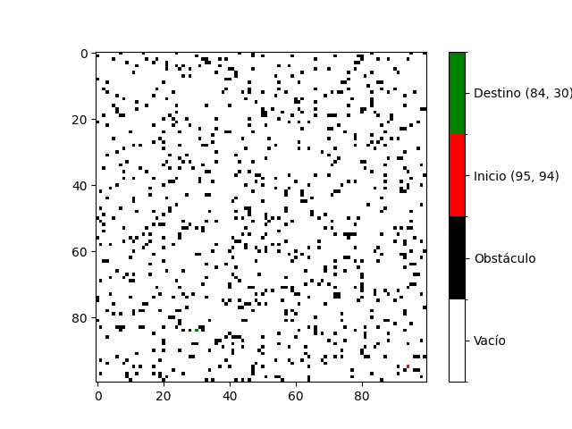

### Entorno 8

  

### Entorno 9

  

### Entorno 10

  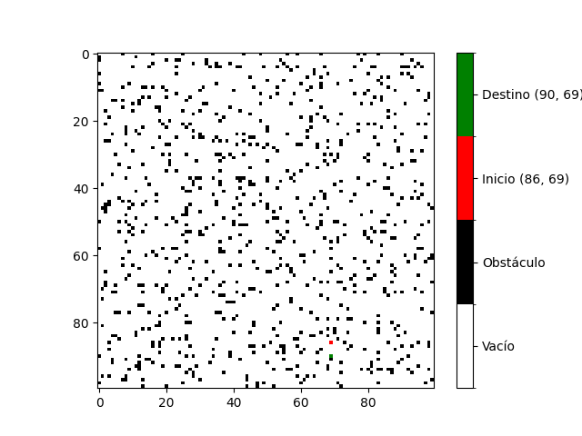

### Entorno 11

  

### Entorno 12

  

### Entorno 13

  

### Entorno 14

  

### Entorno 15

  

### Entorno 16

  

### Entorno 17

  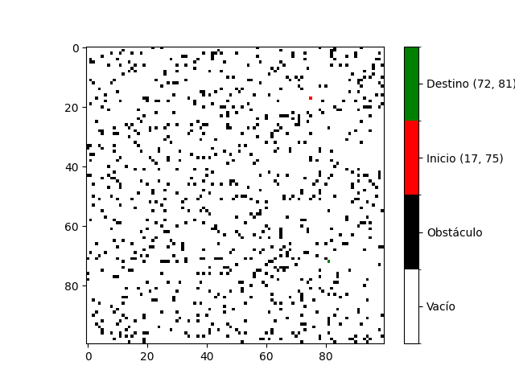

### Entorno 18

  

### Entorno 19

  

### Entorno 20

  

### Entorno 21

  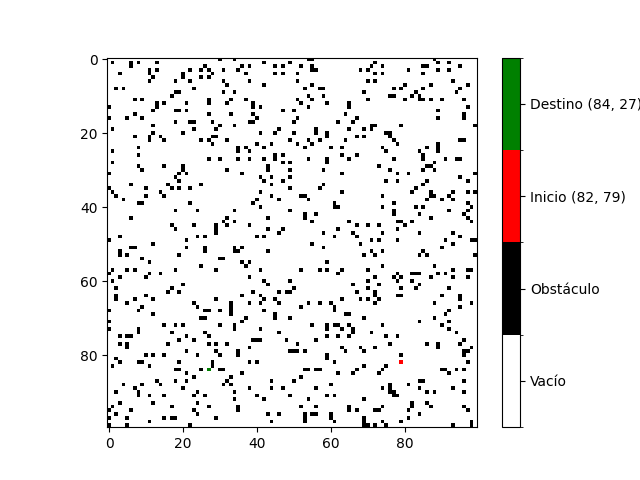

### Entorno 22

  

### Entorno 23

  

### Entorno 24

  

### Entorno 25

  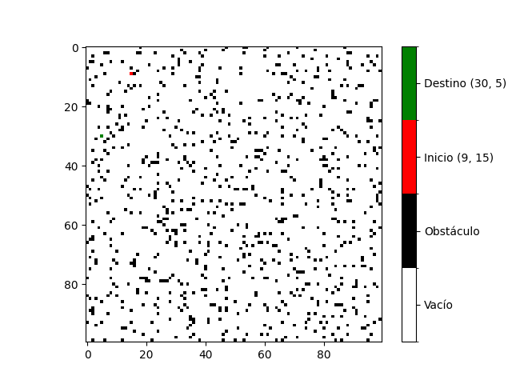

### Entorno 26

  

### Entorno 27

  

### Entorno 28

  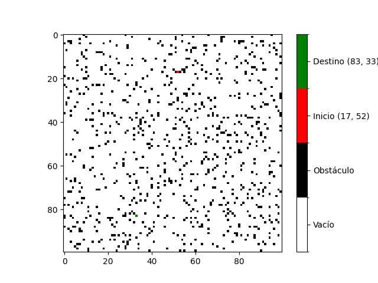

### Entorno 29

  

### Entorno 30

  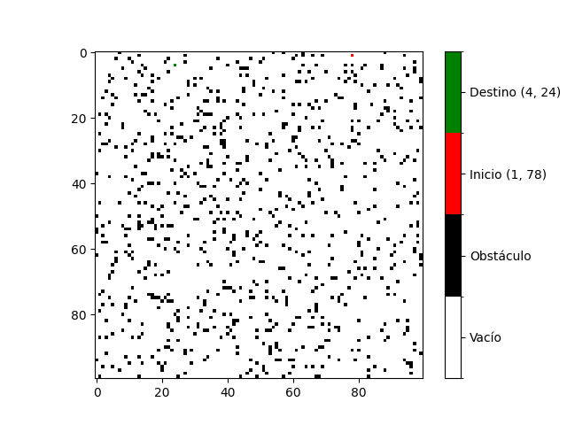

## Raw Data
**Agente: BFSAgent**
- **Estados explorados en promedio:** 3783.733333333333
  - **Desviación estándar:** 2906.5214537174056
- **Costo de la solución en promedio:** 62.666666666666664
  - **Desviación estándar:** 41.3924308700677

**Agente: DFSAgent**
- **Estados explorados en promedio:** 3092.8333333333335
  - **Desviación estándar:** 2605.6938990223503
- **Costo de la solución en promedio:** 743.7333333333333
  - **Desviación estándar:** 521.570634177943

**Agente: DLSAgent**
- **Estados explorados en promedio:** 2409.4
  - **Desviación estándar:** 1504.9904708141441
- **Costo de la solución en promedio:** 185.6315789473684
  - **Desviación estándar:** 73.83631335319122

**Agente: UniformCostAgent**
- **Estados explorados en promedio:** 3854.0333333333333
  - **Desviación estándar:** 2893.5199120809925
- **Costo de la solución en promedio:** 62.666666666666664
  - **Desviación estándar:** 41.3924308700677