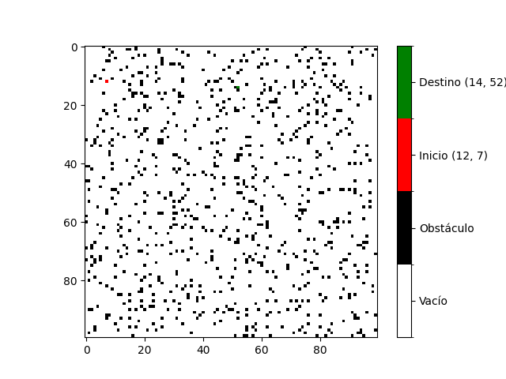

# Trabajo Práctico 4: Búsqueda informada
**Estudiante:** Del Longo, Micaela

[**Link al TP:** https://docs.google.com/document/d/1tiR1-6OG6KcwdsWdJNemLShTyV38S1jho7ObcrUI2bw/edit#heading=h.lqya3ojnc5h1](https://docs.google.com/document/d/1tiR1-6OG6KcwdsWdJNemLShTyV38S1jho7ObcrUI2bw/edit#heading=h.lqya3ojnc5h1)

## Ejercicio B
Ejecutar un total de 30 veces el algoritmo A* en un escenario aleatorio con una tasa de obstáculos del 8 por ciento, 
calcular la media y la desviación estándar de la cantidad de estados explorados para llegar al destino (si es que fue 
posible). Evaluar cada uno de los algoritmos sobre el mismo conjunto de datos generado. Presentar los resultados en un 
gráfico de cajas y bigotes o boxplot. Incluya también los resultados obtenidos en el punto B del TP3 sobre búsquedas no 
informadas.

### Representación Tabular de los Resultados
| Agente           | Estados explorados (promedio) | Desviación estándar | Costo de la solución (promedio) | Desviación estándar | Porcentaje de éxito |
|------------------|-------------------------------|---------------------|---------------------------------|---------------------|---------------------|
| BFSAgent         | 5133.37                       | 2753.95             | 75                              | 35.52               | 100.00%             |
| AStarAgent       | 133.10                        | 107.47              | 75                              | 35.52               | 100.00%             |
| DLSAgent         | 2759.10                       | 1448.07             | 213.44                          | 60.37               | 60.00%              |
| UniformCostAgent | 5209.87                       | 2747.22             | 75                              | 35.52               | 100.00%             |
| DFSAgent         | 2856.23                       | 2361.80             | 873.87                          | 524.74              | 100.00%             |

Los resultados sin redondear se encuentran en la sección [Raw Data](#raw-data) y los 30 entornos generados se 
encuentran en la sección [Entornos Generados](#entornos-generados).

### Gráfico de Cajas y Bigotes para los Estados Explorados

### Gráfico de Cajas y Bigotes para el Costo de la Solución (path_cost)

## Raw Data

Agente: **BFSAgent**
- Estados explorados en promedio: 5133.366666666667
- Desviación estándar: 2753.9521003939717
- Costo de la solución en promedio: 75
- Desviación estándar: 35.52269794040871

Agente: **AStarAgent**
- Estados explorados en promedio: 133.1
- Desviación estándar: 107.46750912364806
- Costo de la solución en promedio: 75
- Desviación estándar: 35.52269794040871

Agente: **DLSAgent**
- Estados explorados en promedio: 2759.1
- Desviación estándar: 1448.06763868505
- Costo de la solución en promedio: 213.44444444444446
- Desviación estándar: 60.36674408024399

Agente: **UniformCostAgent**
- Estados explorados en promedio: 5209.866666666667
- Desviación estándar: 2747.218075439769
- Costo de la solución en promedio: 75
- Desviación estándar: 35.52269794040871

Agente: **DFSAgent**
- Estados explorados en promedio: 2856.233333333333
- Desviación estándar: 2361.801455688423
- Costo de la solución en promedio: 873.8666666666667
- Desviación estándar: 524.7401809193426

### Porcentaje de entornos resueltos por agente:
- Porcentaje de veces que **BFSAgent** encontró la solución: 100.00%
- Porcentaje de veces que **AStarAgent** encontró la solución: 100.00%
- Porcentaje de veces que **DLSAgent** encontró la solución: 60.00%
- Porcentaje de veces que **UniformCostAgent** encontró la solución: 100.00%
- Porcentaje de veces que **DFSAgent** encontró la solución: 100.00%

## Entornos Generados

### Entorno 1

  

### Entorno 2

  

### Entorno 3

  

### Entorno 4

  

### Entorno 5

  

### Entorno 6

  

### Entorno 7

  

### Entorno 8

  

### Entorno 9

  

### Entorno 10

  

### Entorno 11

  

### Entorno 12

  

### Entorno 13

  

### Entorno 14

  

### Entorno 15

  

### Entorno 16

  

### Entorno 17

  

### Entorno 18

  

### Entorno 19

  

### Entorno 20

  

### Entorno 21

  

### Entorno 22

  

### Entorno 23

  

### Entorno 24

  

### Entorno 25

  

### Entorno 26

  

### Entorno 27

  

### Entorno 28

  

### Entorno 29

  

### Entorno 30

  

