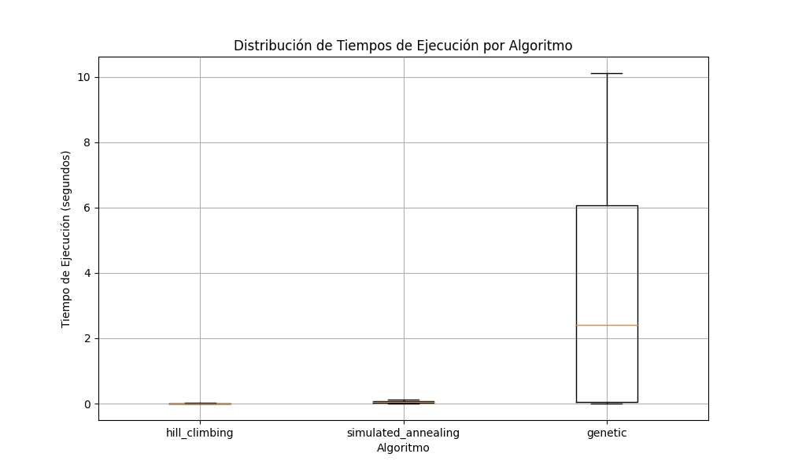
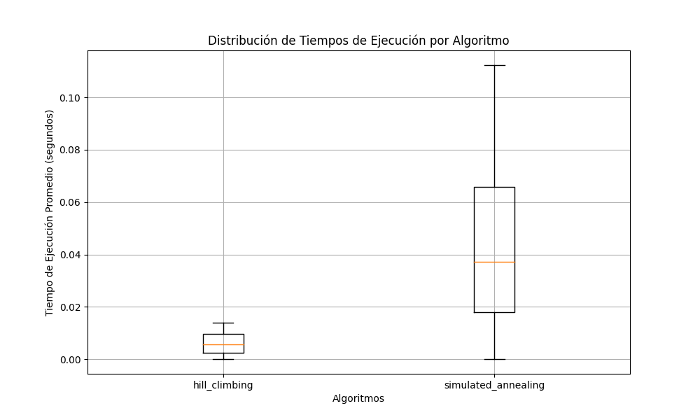
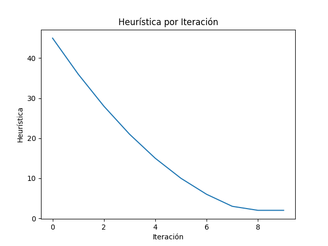
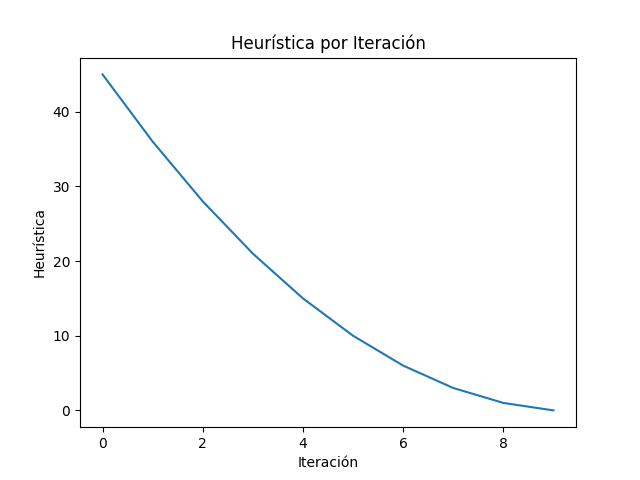
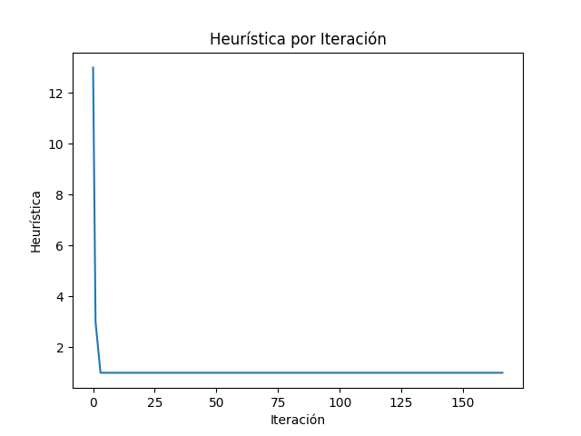

# Trabajo Práctico 5: Búsqueda Local
**Estudiante:** Del Longo, Micaela (11653)

[**Link al TP:** https://docs.google.com/document/d/1Ocz9ZmOkIiVV7kgDguH99cpOWDKuxoKF6hwgtIv_NNQ/edit](https://docs.google.com/document/d/1Ocz9ZmOkIiVV7kgDguH99cpOWDKuxoKF6hwgtIv_NNQ/edit)

## Parte II
**Estrategias utilizadas para el algoritmo "Genético"**
- **Población inicial**: Dado un problema de tamaño n, se genera una población de 10*n individuos.
- **Selección**: Se utiliza el método de selección por torneo, con un tamaño de torneo de 1/4 del tamaño de la población.
- **Cruce**: Se utiliza el método de cruce por orden.
- **Mutación**: Se utiliza el método de mutación por intercambio aleatorio.
- **Reemplazo/Culling**: Se utiliza el método de culling por elitismo.

### Ejercicio A
Ejecutar cada uno de los algoritmos implementados en la parte I 30 veces y calcular para el caso de 4, 8,10,(12,15)? 
reinas:

1. El número (porcentaje) de veces que se llega a un estado de solución óptimo.

    | Tamaño del Tablero | Algoritmo           | Porcentaje de Éxito |
    |--------------------|---------------------|---------------------|
    | 4                  | Hill Climbing       | 100%                |
    | 4                  | Simulated Annealing | 100%                |
    | 4                  | Genetic             | 100%                |
    | 8                  | Hill Climbing       | 23.33%              |
    | 8                  | Simulated Annealing | 96.66%              |
    | 8                  | Genetic             | 100%                |
    | 10                 | Hill Climbing       | 6.66%               |
    | 10                 | Simulated Annealing | 100%                |
    | 10                 | Genetic             | 66.66%              |
    | 12                 | Hill Climbing       | 10%                 |
    | 12                 | Simulated Annealing | 96.66%              |
    | 12                 | Genetic             | 56.66%              |

2. El tiempo de ejecución promedio y la desviación estándar para encontrar dicha solución.

    | Tamaño del Tablero | Algoritmo           | Tiempo Promedio (s) | Desviación Estándar (s) |
    |--------------------|---------------------|---------------------|-------------------------|
    | 4                  | Hill Climbing       | 0.000137            | 0.000355                |
    | 4                  | Simulated Annealing | 0.000067            | 0.000254                |
    | 4                  | Genetic             | 0.001078            | 0.000834                |
    | 8                  | Hill Climbing       | 0.003192            | 0.000996                |
    | 8                  | Simulated Annealing | 0.024113            | 0.059372                |
    | 8                  | Genetic             | 0.071334            | 0.175161                |
    | 10                 | Hill Climbing       | 0.008122            | 0.002162                |
    | 10                 | Simulated Annealing | 0.050353            | 0.061463                |
    | 10                 | Genetic             | 4.732042            | 5.780583                |
    | 12                 | Hill Climbing       | 0.013927            | 0.001788                |
    | 12                 | Simulated Annealing | 0.112326            | 0.236488                |
    | 12                 | Genetic             | 10.11651            | 10.62391                |

3. La cantidad de estados previos promedio y su desviación estándar por los que tuvo que pasar para llegar a una 
solución.

    | Tamaño del Tablero | Algoritmo           | Cantidad de Estados Promedio | Desviación Estándar |
    |--------------------|---------------------|------------------------------|---------------------|
    | 4                  | Hill Climbing       | 3                            | 0                   |
    | 4                  | Simulated Annealing | 3                            | 0                   |
    | 4                  | Genetic             | 1.3                          | 0.4                 |
    | 8                  | Hill Climbing       | 6.4                          | 0.5                 |
    | 8                  | Simulated Annealing | 75.4                         | 181.7               |
    | 8                  | Genetic             | 11.1                         | 29.8                |
    | 10                 | Hill Climbing       | 8.4                          | 0.6                 |
    | 10                 | Simulated Annealing | 65.1                         | 79.0                |
    | 10                 | Genetic             | 395.4                        | 481.0               |
    | 12                 | Hill Climbing       | 10.3                         | 0.5                 |
    | 12                 | Simulated Annealing | 85.4                         | 179.1               |
    | 12                 | Genetic             | 460.4                        | 483.3               |

4. Generar una tabla con los resultados para cada uno de los algoritmos desarrollados y guardarla en formato .csv.

    La tabla se encuentra en el archivo [busquedas-locales-results.csv](busquedas-locales-results.csv).
5. Realizar un gráfico de cajas (boxplot) que muestre la distribución de los tiempos de ejecución de cada algoritmo.
    
    

    Vista en detalle de Hill Climbing y Simulated Annealing:

    

### Ejercicio B
Para cada uno de los algoritmos, graficar la variación de la función h() a lo largo de las iteraciones. (Considerar 
solo una ejecución en particular).

El tamaño del tablero utilizado para la ejecución de los algoritmos fue de 10. En el caso del algoritmo genético, se
utilizarón las mismas estrategias ya previamente mencionadas.

**Hill Climbing**

Resultado de la ejecución:
- Máximo local alcanzado.
- Estado: [6, 2, 0, 7, 0, 8, 9, 4, 1, 3],
- Valor: 43.0,
- Heurística: 2,
- Estados Evaluados: 8

**Simulated Annealing**

Resultado de la ejecución:
- Solución encontrada.
- Estado: [4, 2, 0, 9, 6, 8, 3, 1, 7, 5],
- Valor: 45.0,
- Heurística: 0,
- Estados Evaluados: 9

**Genetic**

Resultado de la ejecución:
- Solución encontrada.
- Estado: [3, 5, 9, 2, 0, 7, 4, 1, 8, 6],
- Valor: 45.0,
- Heurística: 0,
- Estados Evaluados: 167

### Ejercicio C
Indicar según su criterio, cuál de los tres algoritmos implementados resulta más adecuado para la solución del problema
de las n-reinas. Justificar.

Teniendo en cuenta los resultados obtenidos, el algoritmo que resulta más adecuado para obtener la solución del problema 
de las n-reinas es el algoritmo de **Simulated Annealing**. Esto se debe a que, en la mayoría de los casos, el algoritmo
encuentra la solución óptima, en un tiempo de ejecución relativamente corto y con una cantidad de estados evaluados
también relativamente baja. 
