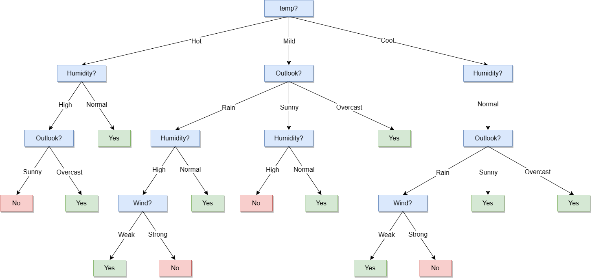

**Estudiante:** Del Longo, Micaela (11653)

# Parte C

## Ejercicio 1
_Implementar un algoritmo para construir un árbol de decisión de acuerdo al pseudocódigo provisto en AIMA._
   1. _El algoritmo solo deberá considerar variables discretas._ 
   2. _Se deberá comprobar su correcto funcionamiento de manera empírica sobre el dataset tennis.csv_ 

Los resultados sobre el dataset ``tennis.csv`` fueron los siguientes:

```
Test temp:
Parent: None
  temp = Hot
  temp = Mild
  temp = Cool
Test humidity:
Parent: temp = Hot
  humidity = High
  humidity = Normal
Test outlook:
Parent: temp = Mild
  outlook = Rain
  outlook = Sunny
  outlook = Overcast
Test humidity:
Parent: temp = Cool
  humidity = Normal
Test outlook:
Parent: humidity = High
  outlook = Sunny
  outlook = Overcast
Classify as Yes (Parent: humidity = Normal)
Test humidity:
Parent: outlook = Rain
  humidity = High
  humidity = Normal
Test humidity:
Parent: outlook = Sunny
  humidity = High
  humidity = Normal
Classify as Yes (Parent: outlook = Overcast)
Test outlook:
Parent: humidity = Normal
  outlook = Rain
  outlook = Overcast
  outlook = Sunny
Classify as No (Parent: outlook = Sunny)
Classify as Yes (Parent: outlook = Overcast)
Test wind:
Parent: humidity = High
  wind = Weak
  wind = Strong
Classify as Yes (Parent: humidity = Normal)
Classify as No (Parent: humidity = High)
Classify as Yes (Parent: humidity = Normal)
Test wind:
Parent: outlook = Rain
  wind = Weak
  wind = Strong
Classify as Yes (Parent: outlook = Overcast)
Classify as Yes (Parent: outlook = Sunny)
Classify as Yes (Parent: wind = Weak)
Classify as No (Parent: wind = Strong)
Classify as Yes (Parent: wind = Weak)
Classify as No (Parent: wind = Strong)
```

El diagrama del árbol de decisión obtenido es el siguiente:
<div align="center">
    
</div>

## Ejercicio 2
_Investigar sobre las estrategias de los árboles de decisión para datos de tipo real y elaborar un breve resumen._

### Atributos de entrada continuos y de valor entero: 

Los atributos continuos o de valor entero, como Altura y Peso, tienen un conjunto infinito de posibles valores. En lugar
de generar infinitas ramas, los algoritmos de aprendizaje de árboles de decisión típicamente encuentran el 
**punto de división** que proporciona la mayor ganancia de información. Por ejemplo, en un nodo dado del árbol, podría 
ser el caso que la prueba "Peso > 160" proporcione la mayor información. 

Existen **métodos** eficientes para encontrar buenos puntos de división: estos comienzan por ordenar los valores del
atributo y luego consideran solo los puntos de división que se encuentran entre dos ejemplos que tienen clasificaciones 
diferentes, mientras se realiza un seguimiento de los totales acumulados de ejemplos positivos y negativos a cada lado 
del punto de división. La división es la parte **más costosa** de las aplicaciones de aprendizaje de árboles de decisión
en el mundo real (real-world decision tree).

### Atributos de salida de valor continuo: 

Si estamos tratando de predecir una salida numérica, como el precio de un apartamento, entonces necesitamos un 
**árbol de regresión** en lugar de un árbol de clasificación. Un árbol de regresión tiene en cada hoja una función 
lineal de algún subconjunto de atributos numéricos, en lugar de un valor único. Por ejemplo, la rama para apartamentos 
de dos habitaciones podría terminar con una función lineal de metraje cuadrado, número de baños e ingreso promedio para 
el vecindario. El algoritmo de aprendizaje debe **decidir cuándo dejar de dividir** y comenzar a **aplicar la** 
**regresión lineal** sobre los atributos.

**Fuente:** Norvig, Peter; Russell, Stuart. (2009). _Artificial Intelligence: A Modern Approach_ (3rd ed., p. 707). Prentice Hall.
